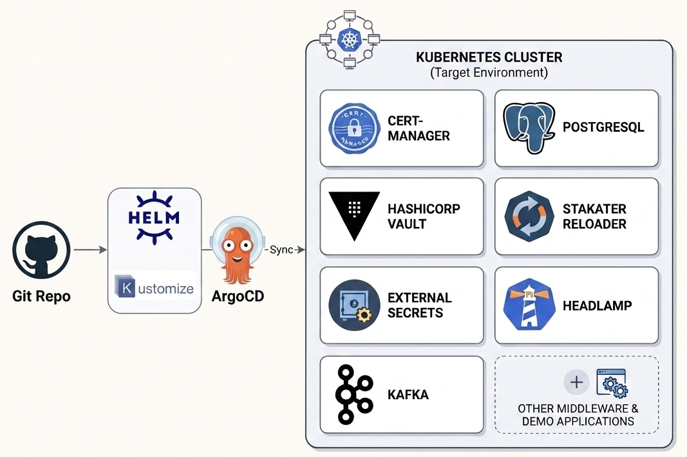

# Kubernetes GitOps Cluster Provisioning Automation

This repository contains a collection of "Wrapper" Helm charts and Kustomize overlays used to bootstrap a standardized environment on Kubernetes or OpenShift for our POC and Demo projects.

The goal of this repository is to provide a consistent "Landing Zone" for applications, ensuring they have immediate access to various applications dealing with cross-cutting concerns such as security, config / secret management, database services, etc., regardless of the underlying Kubernetes cluster type.

## Platform Architecture

The following diagram shows how the components interact to create a secure, automated environment. Even though this is a Demo/POC environment, it utilizes mTLS, Certificate Rotation, Secret Orchestration, and various other concepts to mimic a production-grade architecture.

## Getting Started

1. **Prepare your Cluster:** Ensure you have a running Kubernetes or OpenShift cluster. Refer to the [infra-setup](https://github.com/Microservices-Demo-Projects/infra-setup) repository for setup instructions (Local OpenShift - CRC / Kubernetes - Kind; Cloud - EKS, etc.).
2. **Install Tools:** Ensure you have `helm`, `kubectl`, and `oc` (if using OpenShift) installed.
3. **Choose Deployment Method:** Proceed with either **Option 1 (ArgoCD)** or **Option 2 (Manual)** as detailed in the section below.

> [!WARNING]
> This repository is intended for Demo and POC purposes. While it follows several production-ready security best practices, always review configurations before using in a production / critical environment.

---

## Deployment Options

You can deploy the platform components in this repository using two different methods:

### Option 1: Automated Deployment (via ArgoCD)
The repository is structured to support fully automated GitOps workflows. You can deploy the entire platform stack simultaneously by pointing ArgoCD to the centralized configurations located in the `/argocd` folder. 
- *For a step-by-step guide on setting up automated synchronization and dependencies, please refer to the [ArgoCD Setup Guide](./argocd/README.md).*

### Option 2: Manual Installation (Component-by-Component)
If you prefer to install, test, or troubleshoot components individually without using ArgoCD, you can deploy them manually using standard CLI tools.

To do this, navigate to the individual directories in the **Components Catalog** below and follow the specific instructions inside each component's `README.md` in the recommended order.

---

## Components Catalog

To ensure a successful deployment (especially when installing manually), follow the recommended installation sequence documented within each chart's readme.

| S.No | Component | Description | Status |
| --- | --- | --- | --- |
| 1 | [Cert-Manager](./cert-manager/) | Automates TLS certificate issuance and renewal. | ✅ Ready |
| 2 | [HashiCorp Vault](./hashicorp-vault/) | Centralized secret management and dynamic credential generation / rotation. | ✅ Ready |
| 3 | [External Secrets](./external-secrets/) | Syncs secrets from Vault into native Kubernetes Secrets. | ✅ Ready |
| 4 | [PostgreSQL](./postgres/) | Secure, TLS-enabled database with Vault credential creation / rotation. | ✅ Ready |
| 5 | [Stakater Reloader](./stakater-reloader/) | Triggers automatic app restarts when Secrets/ConfigMaps change so that the new config / secret values are loaded into the app. | ✅ Ready |
| 6 | [Headlamp](./headlamp/) | Modern Kubernetes UI (Dashboard) required only for standard Kubernetes clusters. For OpenShift the native UI is used. | ✅ Ready |
| 7 | [Kafka](./kafka/) | Distributed event streaming platform for high-performance data pipelines. | ❌ To Do |